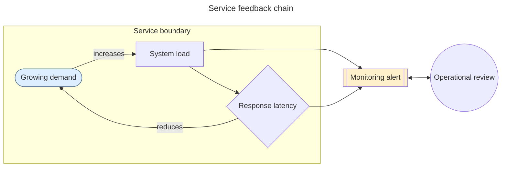

# Example cause-effect chain

Import this Markdown file as a metamodel. The single Mermaid block is used;
surrounding prose is ignored.

```mermaid
---
title: Service feedback chain
---
flowchart LR
  subgraph service["Service boundary"]
    Demand(["Growing demand"]):::input -- increases --> Load["System load"]
    Load --> Latency{"Response latency"}
    Latency -- reduces --> Demand
  end
  Load & Latency --> Alert[["Monitoring alert"]]
  Alert <--> Review(("Operational review"))
  classDef input fill:#dceeff,stroke:#507090
  style Alert fill:#fff0cc
```
